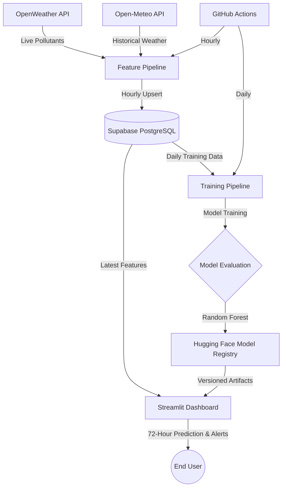

# Pearls AQI Predictor: End-to-End Serverless MLOps Pipeline 🌬️

**Author:** Muhammad Hashir Awaiz
**Institution:** Ghulam Ishaq Khan Institute of Engineering Sciences and Technology (GIKI)
**Program:** BS Artificial Intelligence
**Live Application:** [Sialkot AQI Predictor · Streamlit](https://sialkot-aqi-predictor.streamlit.app)

An end-to-end, serverless machine learning architecture engineered to forecast the Air Quality Index (AQI) in Sialkot, Pakistan, **72 hours (3 days) in advance**.

The project demonstrates a production-oriented MLOps lifecycle featuring automated data ingestion, chronological model evaluation, automated retraining, model versioning, and real-time dashboarding.

---

## 1. System Architecture

The infrastructure prioritizes robust, free-tier-friendly services capable of supporting scheduled CI/CD workflows without requiring an always-on server.



### Pipeline Flow

1. **Data ingestion** collects pollutant and weather information from external APIs.
2. **Feature engineering** transforms raw measurements into model-ready features.
3. **Supabase PostgreSQL** acts as the persistent feature store.
4. **GitHub Actions** automatically executes the pipelines on scheduled cron jobs.
5. **Training** evaluates multiple models using a chronological train/test split.
6. **Model registry** stores versioned model artifacts on Hugging Face.
7. **Streamlit** loads the latest model and live features to generate 72-hour AQI predictions.

---

## 2. Internship Requirements Satisfaction

This repository fulfills the major requirements outlined in the Pearls AQI Predictor project brief.

* ✅ **Feature Pipeline:** Fetches live weather and pollutant data, computes **32 engineered features** including cyclical time encodings and derived ratios, and securely upserts them into the **Supabase PostgreSQL** feature store.

* ✅ **Historical Backfill:** Performs a **90-day historical backfill**, merging OpenWeather pollutant history with Open-Meteo weather data and handling database deduplication.

* ✅ **Exploratory Data Analysis:** Performs EDA after data preparation, including correlation analysis and investigation of sensor anomalies.

* ✅ **Training Pipeline:** Evaluates three different architectures — **Ridge Regression, PyTorch MLP, and Random Forest** — using a strict chronological split to reduce the risk of future-data leakage.

* ✅ **Model Registry:** Stores trained models, preprocessing artifacts such as `SimpleImputer`, metadata, and SHAP explainability outputs in the **Hugging Face Hub**.

* ✅ **CI/CD Automation:** Uses **GitHub Actions** to orchestrate automated feature ingestion and model retraining.

* ✅ **Web Dashboard:** A **Streamlit** frontend serves predictions and converts AQI values into actionable environmental health alerts.

---

## 3. Model Results & Performance Analysis

The training pipeline evaluates the three candidate models against a **Persistence Baseline**.

The persistence baseline assumes that the AQI 72 hours into the future will be identical to the current AQI.

| Model                      |      RMSE |       MAE |  R² Score |
| -------------------------- | --------: | --------: | --------: |
| Persistence Baseline       |     50.46 |     32.61 |     -1.29 |
| Ridge Regression           |     43.27 |     34.28 |     -0.69 |
| PyTorch MLP                |     41.69 |     30.12 |     -0.56 |
| **Random Forest (Winner)** | **37.86** | **28.79** | **-0.29** |

### Why Is R² Negative?

A negative R² does **not** automatically mean that the model is useless.

The coefficient of determination is:

**R² = 1 - (SS_res / SS_tot)**

where:

* **SS_res** is the sum of squared prediction errors.
* **SS_tot** is the total variance of the target relative to its mean.

An R² value below zero means the model performs worse than simply predicting the **mean of the test-set target** according to the R² metric.

In this project, several characteristics of the dataset make R² particularly sensitive.

### 1. Extreme AQI Observations

The dataset contains anomalous AQI observations, including values reaching the API's upper range of **500**.

Because both RMSE and R² involve squared errors, extreme observations can have a disproportionate effect on evaluation metrics.

However, the claim that these values are definitively caused by **hardware glitches** should only be made if the source data or API documentation confirms that. They are safer to describe as **potential sensor/API anomalies** unless their origin has been independently verified.

### 2. Three-Day Forecasting Constraint

A 72-hour forecast ideally benefits from future weather information such as:

* Forecasted precipitation
* Forecasted temperature
* Forecasted wind speed
* Forecasted atmospheric pressure
* Forecasted humidity

The current pipeline primarily uses historical observations and temporal features. It therefore does not have direct access to the actual future weather conditions at prediction time.

This limits the amount of information available to the model for a three-day forecast.

### 3. R² Should Not Be Evaluated in Isolation

The Random Forest achieves:

* **RMSE:** 37.86
* **MAE:** 28.79

compared with the persistence baseline:

* **RMSE:** 50.46
* **MAE:** 32.61

The Random Forest therefore reduces RMSE by approximately **25% relative to the persistence baseline**:

**((50.46 - 37.86) / 50.46) × 100 ≈ 24.97%**

and reduces MAE by approximately:

**((32.61 - 28.79) / 32.61) × 100 ≈ 11.7%**

This makes the Random Forest the strongest of the evaluated models according to the reported RMSE and MAE.

> **Important:** A negative R² should not be explained as being caused solely by outliers. R² depends on the relationship between residual error and target variance, so the negative value can result from several properties of the dataset and forecasting problem.

---

## 4. Why Random Forest Was Selected

Among the evaluated models, Random Forest achieved the lowest RMSE and MAE.

It was therefore selected as the production model based on the project's primary error metrics.

Random Forest is also well suited to this feature set because it can model:

* Non-linear relationships
* Feature interactions
* Threshold effects
* Mixed feature scales
* Complex relationships between weather, pollution, and temporal variables

No feature standardization is required for the Random Forest itself.

---

## 5. Tech Stack

| Category                 | Technology                      |
| ------------------------ | ------------------------------- |
| Language                 | Python 3.12                     |
| Data Ingestion           | OpenWeather API, Open-Meteo API |
| Database / Feature Store | Supabase PostgreSQL             |
| Machine Learning         | scikit-learn, PyTorch           |
| Model Explainability     | SHAP                            |
| Model Registry           | Hugging Face Hub                |
| CI/CD                    | GitHub Actions                  |
| Dashboard                | Streamlit                       |
| Deployment               | Streamlit Cloud                 |

---

## 6. Repository Structure

```text
aqi-predictor/
├── .env.example
├── .gitignore
├── README.md
├── requirements.txt
│
├── src/
│   ├── config.py
│   ├── feature_pipeline.py
│   ├── backfill_historical.py
│   ├── training_pipeline.py
│   └── eda.py
│
├── app/
│   └── dashboard.py
│
├── artifacts/
│   └── # Generated model artifacts
│
├── eda_outputs/
│   └── # Generated EDA visualizations
│
└── .github/
    └── workflows/
        ├── feature_pipeline.yml
        └── training_pipeline.yml
```

### Directory Responsibilities

| Path                         | Purpose                                                     |
| ---------------------------- | ----------------------------------------------------------- |
| `src/config.py`              | Central configuration and environment variables             |
| `src/feature_pipeline.py`    | Fetches live data, engineers features, and updates Supabase |
| `src/backfill_historical.py` | Retrieves and merges historical weather and pollutant data  |
| `src/training_pipeline.py`   | Trains, evaluates, and registers models                     |
| `src/eda.py`                 | Generates exploratory analysis and visualizations           |
| `app/dashboard.py`           | Streamlit prediction dashboard                              |
| `artifacts/`                 | Generated local model artifacts                             |
| `eda_outputs/`               | Generated EDA plots                                         |
| `.github/workflows/`         | Automated CI/CD workflows                                   |

---

## 7. Local Setup

### 7.1 Clone the Repository

```bash
git clone https://github.com/Muhammad-Hashir-55/aqi-predictor.git
cd aqi-predictor
```

### 7.2 Create a Virtual Environment

On Windows:

```powershell
py -3.12 -m venv venv
venv\Scripts\activate
```

### 7.3 Install Dependencies

```bash
python -m pip install --upgrade pip
pip install -r requirements.txt
```

### 7.4 Configure Environment Variables

Copy the example environment file:

```powershell
copy .env.example .env
```

Then configure the required variables:

```env
OPENWEATHER_API_KEY=your_openweather_api_key
SUPABASE_DB_URL=your_supabase_transaction_pooler_connection_string
HF_TOKEN=your_huggingface_write_token
HF_MODEL_REPO=your_huggingface_repository
```

### Required Credentials

| Variable              | Purpose                                       |
| --------------------- | --------------------------------------------- |
| `OPENWEATHER_API_KEY` | Authentication for OpenWeather API            |
| `SUPABASE_DB_URL`     | PostgreSQL connection string                  |
| `HF_TOKEN`            | Hugging Face authentication with write access |
| `HF_MODEL_REPO`       | Destination repository for model artifacts    |

> **Security:** Never commit `.env` or expose API keys, database credentials, or Hugging Face tokens in source code.

---

## 8. Running the Pipelines

### Step 1 — Historical Backfill

Populate the feature store with 90 days of historical data:

```bash
python src/backfill_historical.py --days 90
```

### Step 2 — Exploratory Data Analysis

Generate EDA outputs:

```bash
python src/eda.py
```

### Step 3 — Train the Models

Train and evaluate the candidate models:

```bash
python src/training_pipeline.py
```

The training pipeline evaluates:

1. Persistence Baseline
2. Ridge Regression
3. PyTorch MLP
4. Random Forest

The best-performing model is then registered with the configured Hugging Face repository.

### Step 4 — Launch the Dashboard

Start the Streamlit application locally:

```bash
streamlit run app/dashboard.py
```

---

## 9. Automated CI/CD

The project uses GitHub Actions to automate the MLOps lifecycle.

### Feature Pipeline

The feature pipeline runs hourly and:

1. Fetches current weather data.
2. Fetches current pollutant data.
3. Generates engineered features.
4. Writes the latest feature row to Supabase.

Example cron schedule:

```yaml
cron: "15 * * * *"
```

This runs at **15 minutes past every hour**.

### Training Pipeline

The training workflow runs daily and:

1. Retrieves training data from Supabase.
2. Performs chronological train/test splitting.
3. Trains the candidate models.
4. Evaluates model performance.
5. Generates explainability artifacts.
6. Registers the selected model with Hugging Face.

Example cron schedule:

```yaml
cron: "0 12 * * *"
```

GitHub Actions cron schedules use **UTC**.

Therefore:

```text
12:00 UTC = 17:00 PKT
```

---

## 10. Data Leakage Prevention

Time-series forecasting requires special care when splitting data.

A random train/test split can allow information from the future to influence the training set.

This project instead uses a **chronological split**, ensuring that training observations occur before evaluation observations.

Conceptually:

```text
Past --------------------------------------------------> Future

|---------------- Training ----------------|--- Testing ---|
```

This better reflects the real-world forecasting scenario:

> Train on the past → predict unseen future observations.

---

## 11. Forecasting Target

The model forecasts AQI **72 hours ahead**.

Conceptually:

```text
t
│
├── Current observations
│
├── Feature engineering
│
├── Model
│
└──────────────────────────────► t + 72 hours
                                  Predicted AQI
```

The prediction target can be represented as:

**y_t = AQI_{t+72}**

where **AQI_{t+72}** represents the AQI observed 72 hours after the feature timestamp (t).

---

## 12. Explainability

The training pipeline generates SHAP-based explainability artifacts to analyze how individual features contribute to model predictions.

This helps answer questions such as:

* Which weather variables influence predictions most?
* Which pollutant measurements are important?
* How much do temporal features contribute?
* Which features drive unusually high or low predictions?

SHAP provides a model-level and prediction-level view of feature contributions rather than treating the model as a complete black box.

---

## 13. Production Dashboard

The deployed Streamlit application provides:

* Current environmental information
* 72-hour AQI prediction
* AQI classification
* Environmental health alerts
* Model-driven forecasting results

### Live Application

**[Sialkot AQI Predictor · Streamlit](https://sialkot-aqi-predictor.streamlit.app)**

---

## 14. Limitations & Future Improvements

The current implementation has several areas that can be improved.

### Future Weather Forecast Features

Integrating forecasted weather variables would provide the model with information about expected atmospheric conditions during the prediction horizon.

### Better Anomaly Detection

AQI observations should be investigated and potentially filtered or corrected using:

* Sensor validation
* Temporal consistency checks
* Robust statistical methods
* External reference measurements

### More Advanced Time-Series Models

Potential future experiments include:

* XGBoost / LightGBM
* Temporal Convolutional Networks
* LSTM / GRU
* Temporal Fusion Transformer
* Dedicated time-series forecasting models

### More Evaluation Metrics

Future evaluation could include:

* MAPE
* SMAPE
* Median Absolute Error
* Prediction interval coverage
* Performance by AQI category

---

## 15. Project Status

**Status:** Production-oriented / actively developed

The current system provides an automated pipeline from data ingestion to model training, model registration, and live prediction.

```text
External APIs
     │
     ▼
Feature Engineering
     │
     ▼
Supabase Feature Store
     │
     ├──────────────► Streamlit Dashboard
     │
     ▼
Automated Training
     │
     ▼
Model Evaluation
     │
     ▼
Hugging Face Registry
     │
     ▼
Production Prediction
```

---

## 16. License

This project is intended for educational, research, and portfolio purposes.
